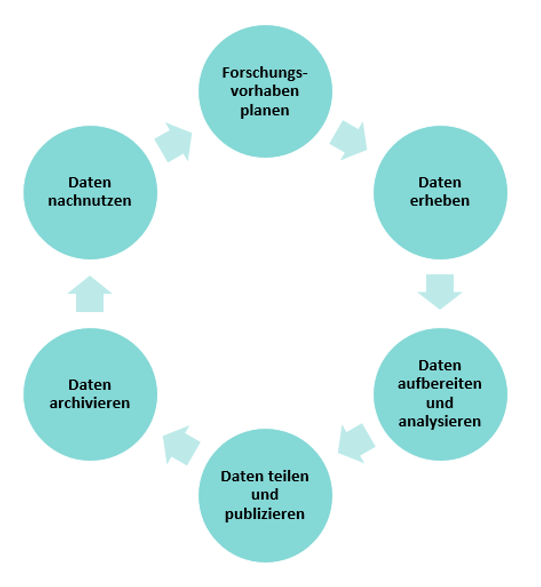

<!--

author:   DINI/nestor UAG Schulungen/Fortbildungen
email:    b.petersen@rz.uni-kiel.de
version:  0.0.1
language: de
narrator: Deutsch Female
title: Train-the-Trainer zum Forschungsdatenmanagement  

comment: Train-the-Trainer zum Forschungsdatenmanagement in LiaScript 

licence: cc-by

logo: Images\DINInestor-logo.png

-->

# Digitale Forschungsdaten

<!-- align=right -->

Was sind Forschungsdaten? So viele Beispiele wie möglich!
---

<small>Quelle: pixabay.com. Dieses Werk ist lizenziert unter einer CC0 1.0 Universal (CC0 1.0) Public Domain Dedication.
https://creativecommons.org/publicdomain/zero/1.0/deed.de </small>

## Was sind Digitale Forschungsdaten?

>- Keine feste Definition von Forschungsdaten
>- Allgemein:
>
>    > „alle (digitalen) Daten, die während des Forschungsprozesses entstehen, gesammelt, oder verarbeitet werden sowie deren Ergebnisse sind“^1,2^

><small> ^1^ Kindling, M.; Schirmbacher, P.: „Die digitale Forschungswelt" als Gegenstand der Forschung. Information - Wissenschaft & Praxis 64 (2013), S. 130. https://doi.org/10.1515/iwp-2013-0017 </small>
> 
><small>^2^DARIAH-DE. „Digitale Forschungsinfrastruktur für die Geistes- und Kulturwissenschaften.“ Zugriff am 08.11.2023, https://de.dariah.eu </small>

### Kurzer Selbsttest

>**Welche der folgenden Items zählen zu (digitalen) Forschungsdaten?**
>(Mehrfachauswahl möglich)
>
>[[X]] Daten, die ich selbst erhoben haben
>[[X]] Messdaten
>[[X]] geografische Koordinaten
>[[X]] Software 
>[[X]] Simulationen 
>[[X]] Texte
>[[X]] Fotos von einem Grabungsschnitt 

## Was passiert mit Daten?

<!-- align=right -->

Drehen und Wenden in Gruppen
---

- Was könnte eine logische Abfolge der gegebenen Elemente sein? 

- Ergänzungen sind möglich.

## Daten-Lebenszyklus

{{0-1}}
***********

Forschungsdaten durchlaufen Phasen 
---

**Beispiel 1: **
<!-- align=right -->
***********

{{1}}
***********

Forschungsdaten durchlaufen Phasen 
---

**Beispiel 2: **
<!-- align=right -->
***********

## Kaffeepause

<!-- align=right -->

## Forschungsdatenmanagement

><big>**Forschungsdatenmanagement (FDM) …**</big>

{{1}}
***********
>… umfasst alle Aktivitäten, die mit der
>
>- Aufbereitung,
>- Speicherung,
>- Archivierung und
>- Veröffentlichung 
>
>von Forschungsdaten verbunden sind.

**************

{{2}}
**********
>… begleitet den Forschungsprozess von den ersten Planungen bis zur Archivierung, Nachnutzung oder Löschung der Daten.  

<small>Quelle: Kindling, M.; Schirmbacher, P.; Simukovic, E.: Forschungsdatenmanagement an Hochschulen: das Beispiel der Humboldt-Universität zu Berlin. LIBREAS. Library Ideas, 23 (2013). Online verfügbar unter: http://libreas.eu/ausgabe23/07kindling/ DOI: 10.18452/9041, Zugriff am 07.11.2023</small>

**************

## Der Nutzen von FDM?
<!-- align=right -->

Gruppendiskussion:
---

- Welchen Nutzen bringt Forschungsdatenmanagement?

{{1}}
**********

Aufgabenstellung:

- "Bitte schaut Euch mit uns das Video 'Where Are the Lost Apollo 11 Moon Landing Tapes?' an." 

- "Überlegt bitte währenddessen, welchen Nutzen FDM gehabt hätte."

!?[alt](https://youtu.be/D2xCisd8ZWg "Where Are the Lost Apollo 11 Moon Landing Tapes?")

**********

#### Die FAIR-Prinzipien

Ein wichtiges Ziel des strukturierten Foschungsdatenmanagements ist es, Daten langfristig und personenunabhängig zugänglich, nachnutzbar und nachprüfbar zu halten. 

Die [**FAIR-Prinzpien**](https://www.nature.com/articles/sdata201618) dienen uns als Leitfaden

{{1}}
>**F**indable

{{2-3}}
****************
Der erste Schritt bei der (Wieder-)Verwendung von Daten besteht darin, sie zu finden. Metadaten und Daten sollten sowohl für Menschen als auch für Computer leicht zu finden sein. Maschinenlesbare Metadaten sind für das automatische Auffinden von Datensätzen und Diensten unerlässlich und daher ein wesentlicher Bestandteil des FAIRification-Prozesses.

F1. (Meta)data are assigned a globally unique and persistent identifier

F2. Data are described with rich metadata (defined by R1 below)

F3. Metadata clearly and explicitly include the identifier of the data they describe

F4. (Meta)data are registered or indexed in a searchable resource

***************

{{1}}
>**A**ccessible

{{3-4}}
***********************
Sobald der Nutzer die gewünschten Daten gefunden hat, muss er wissen, wie er auf sie zugreifen kann, möglicherweise einschließlich Authentifizierung und Autorisierung.

A1. (Meta)data are retrievable by their identifier using a standardised communications protocol

A1.1 The protocol is open, free, and universally implementable

A1.2 The protocol allows for an authentication and authorisation procedure, where necessary

A2. Metadata are accessible, even when the data are no longer available

******************

{{1}}
>**I**nteroperable

{{4-5}}
**********************
Daten sollten in einer Form vorliegen, die die Nutzung mit diversen Anwendungen oder Arbeitsabläufen für die Analyse, Speicherung und Verarbeitung ermöglichen.

I1. (Meta)data use a formal, accessible, shared, and broadly applicable language for knowledge representation.

I2. (Meta)data use vocabularies that follow FAIR principles

I3. (Meta)data include qualified references to other (meta)data

**********************

{{1}}
>**R**eusable

{{5-6}}
***************
Das Ziel von FAIR ist es, die Wiederverwendung von Daten zu optimieren. Um dies zu erreichen, sollten Metadaten und Daten gut dokumentiert und beschrieben sowie mit einer eindeutigen Angabe bzgl. der Nutzungsbedingungen (Lizenzen) versehen sein.

R1. Meta(data) are richly described with a plurality of accurate and relevant attributes

R1.1. (Meta)data are released with a clear and accessible data usage license

R1.2. (Meta)data are associated with detailed provenance

R1.3. (Meta)data meet domain-relevant community standards

**************

## Aspekte im FDM

Forschungsdatenmanagement umfasst eine Vielzahl von thematischen Aspekten

- Ordnung und Strukturierung
- Dokumentation und Metadaten
- Speicherung und Backup
- Langzeitarchivierung
- Sicherheit 
- Publikation
- Rechtliche Aspekte 

Siehe auch: [Lernzielmatrix zum Forschungsdatenmanagement](https://zenodo.org/records/8010617) 
